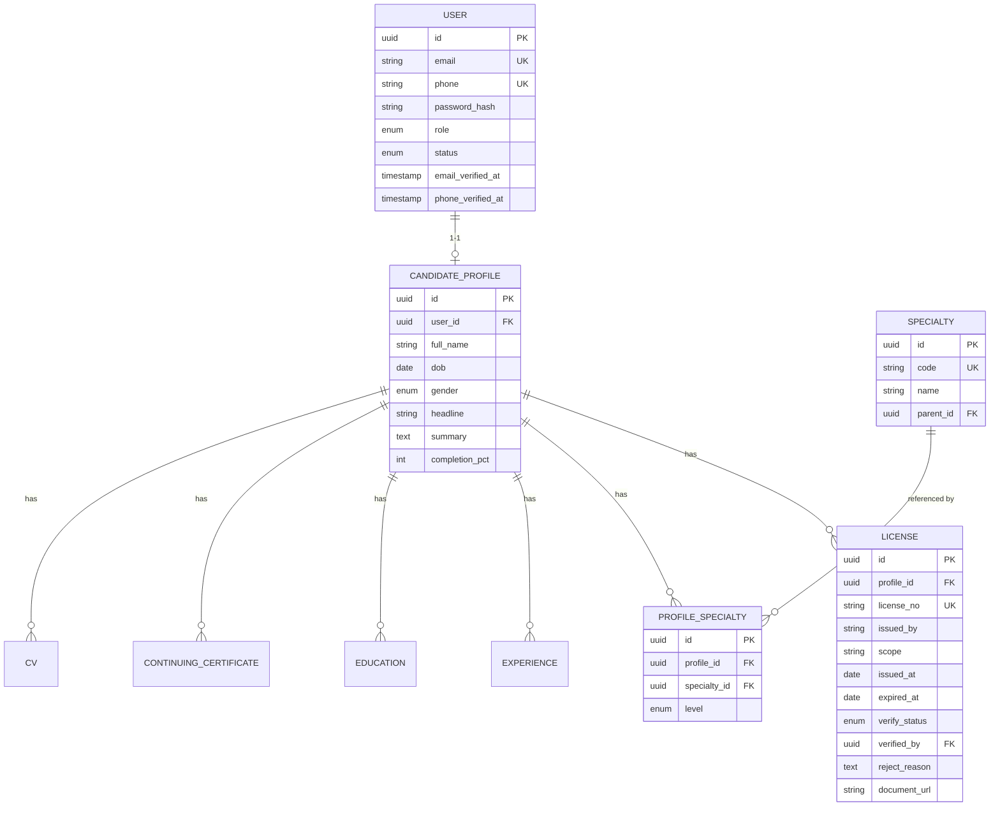
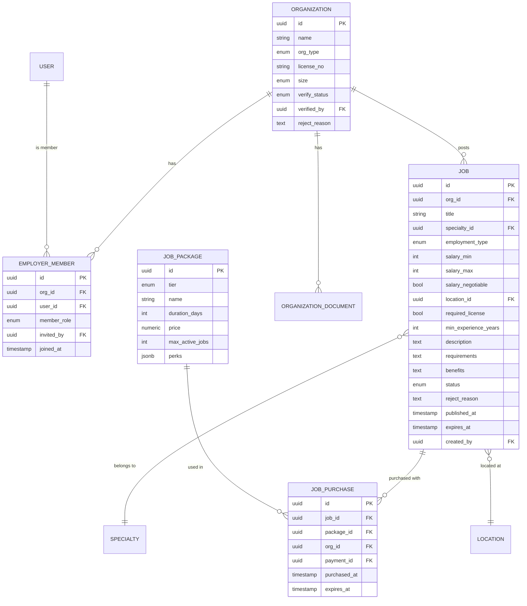
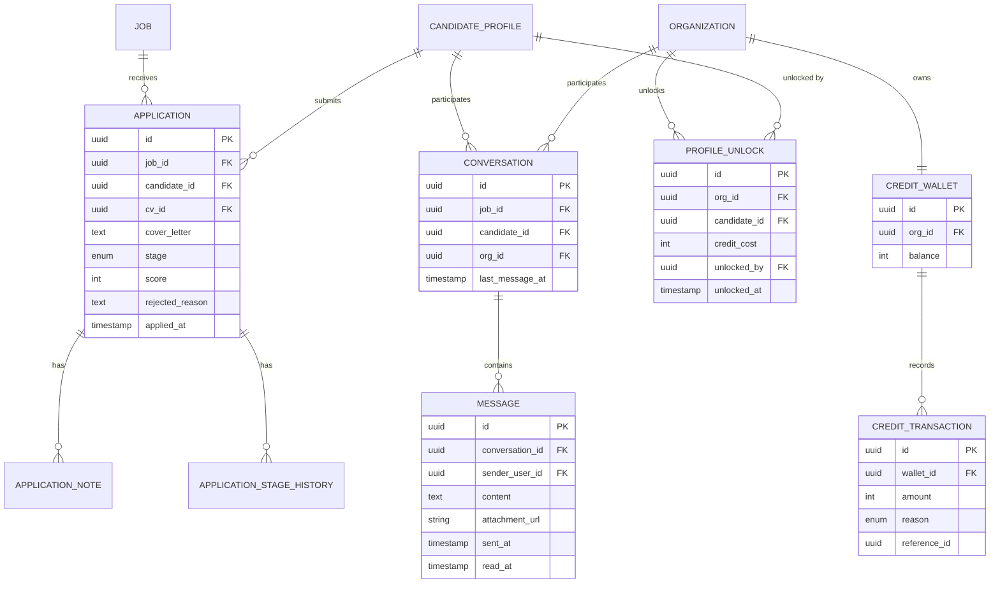
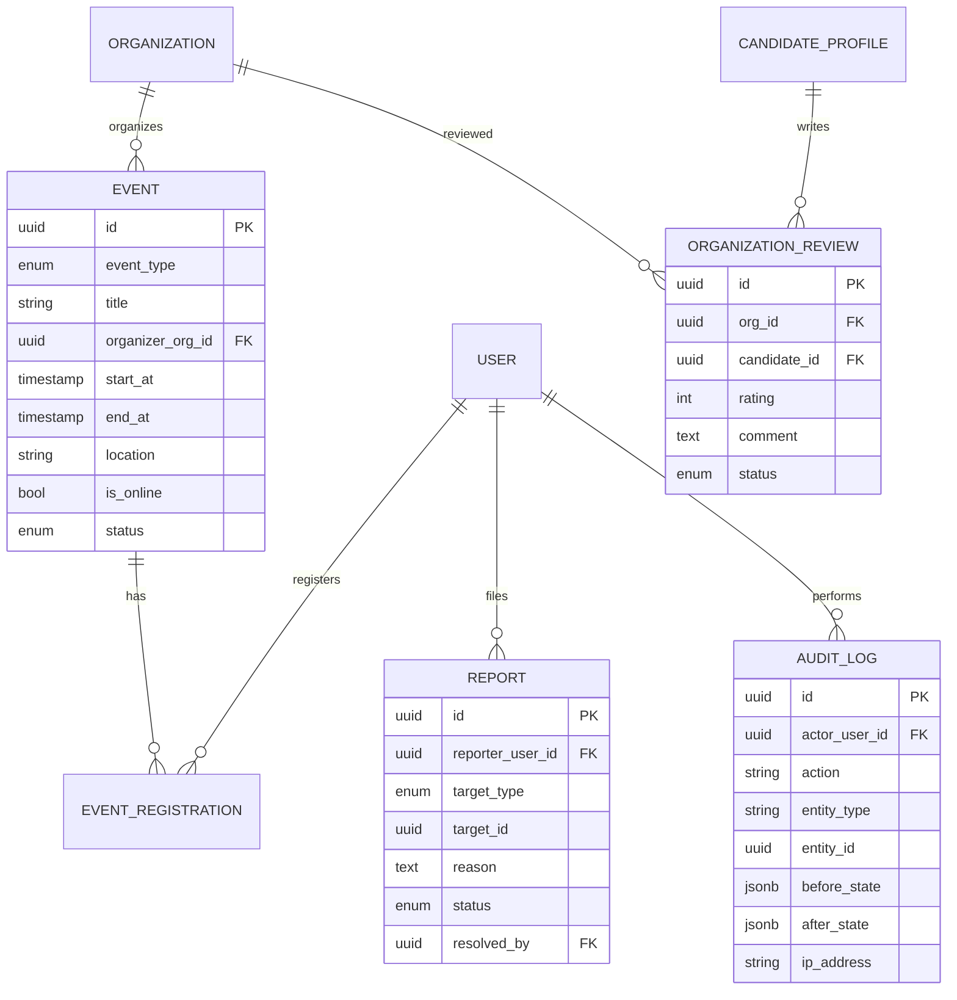

# GiapTech.BlouseHiding — ERD chi tiết

> Cụ thể hóa mô hình dữ liệu cốt lõi của [`../nghiep-vu/PHAN-TICH-NGHIEP-VU.md`](../nghiep-vu/PHAN-TICH-NGHIEP-VU.md)
> và mục 1 (Luồng nghiệp vụ) của [`../nghiep-vu/LUONG-NGHIEP-VU-MAN-HINH.md`](../nghiep-vu/LUONG-NGHIEP-VU-MAN-HINH.md).
> Kiểu dữ liệu viết theo PostgreSQL. Mỗi bảng đều có `id UUID PK`, `created_at`, `updated_at` trừ khi ghi chú khác.
> Quy ước migration: [`QUY-UOC-MIGRATION.md`](./QUY-UOC-MIGRATION.md).

---

## 0. Công nghệ CSDL & lưu trữ

| Thành phần | Lựa chọn | Lý do |
|---|---|---|
| CSDL chính | **PostgreSQL 16+** | Mạnh về JSONB (lưu `data_json` của CV Builder, `payload` thông báo), full-text search sẵn có cho MVP |
| Full-text MVP | Extension **`pg_trgm`** + `tsvector` trên `jobs`, `candidate_profiles` | Đủ dùng cho tìm kiếm ở Giai đoạn 1, tránh vận hành OpenSearch quá sớm |
| Search nâng cao (GĐ2) | **OpenSearch** (thay vì Elasticsearch) | License Apache 2.0 rõ ràng hơn Elastic License, tương thích API Elasticsearch cũ |
| Cache | **Redis 7+** qua `StackExchange.Redis` | Cache kết quả tìm kiếm, session SignalR backplane, rate-limit counter |
| Object storage | **MinIO** tự host (API tương thích S3) | Ảnh CCHN, giấy phép, CV PDF, logo — không lưu trong Postgres |
| Backup | `pg_dump`/`pg_basebackup` định kỳ (cron) + WAL archiving, đẩy bản backup ra **ngoài VPS chính** | Tự host không có snapshot managed — **bắt buộc** có bản sao ngoài máy chủ chính + diễn tập khôi phục định kỳ. Chi tiết quy trình: [`../ha-tang/VAN-HANH-RUNBOOK.md`](../ha-tang/VAN-HANH-RUNBOOK.md) |

---

## 1. Sơ đồ quan hệ theo nhóm (Mermaid ER)

### 1.1 Identity & Hồ sơ ứng viên

### 1.2 Employer & Job

### 1.3 Application, Credit & Messaging

### 1.4 Vận hành, Events & Content (Giai đoạn 3)

---

## 2. Định nghĩa bảng đầy đủ

### 2.1 Identity

**`users`**
| Cột | Kiểu | Ràng buộc | Ghi chú |
|---|---|---|---|
| id | uuid | PK | |
| email | varchar(255) | UNIQUE, NOT NULL | |
| phone | varchar(20) | UNIQUE | |
| password_hash | varchar(255) | NOT NULL | bcrypt/argon2 |
| role | enum | NOT NULL | `candidate`, `employer` (dùng trang **Admin**), `admin`/`moderator` (đội **Vận hành** — xem `../nghiep-vu/PHAN-TICH-NGHIEP-VU.md` mục 2) |
| status | enum | NOT NULL DEFAULT `active` | `active`, `suspended`, `deleted` |
| locale | enum | NOT NULL DEFAULT `vi` | `vi`, `en`, `ja`, `zh`, `ko`, `es` — ngôn ngữ giao diện đã chọn, dùng để gửi email/thông báo đúng ngôn ngữ (xem [ADR-0006](../kien-truc/adr/0006-da-ngon-ngu.md)) |
| email_verified_at | timestamp | nullable | |
| phone_verified_at | timestamp | nullable | |
| created_at / updated_at | timestamp | NOT NULL | |

**`refresh_tokens`**
| Cột | Kiểu | Ràng buộc |
|---|---|---|
| id | uuid | PK |
| user_id | uuid | FK → users |
| token_hash | varchar(255) | NOT NULL |
| expires_at | timestamp | NOT NULL |
| revoked_at | timestamp | nullable |

### 2.2 Hồ sơ ứng viên

**`candidate_profiles`** (1-1 với `users`)
| Cột | Kiểu | Ràng buộc | Ghi chú |
|---|---|---|---|
| id | uuid | PK | |
| user_id | uuid | FK UNIQUE → users | |
| full_name | varchar(255) | NOT NULL | |
| dob | date | nullable | |
| gender | enum | nullable | |
| avatar_url | text | nullable | |
| headline | varchar(255) | nullable | vd. "Điều dưỡng ICU 5 năm kinh nghiệm" |
| summary | text | nullable | |
| address, city_id | varchar / FK | nullable | |
| completion_pct | int | DEFAULT 0 | tính toán, hiển thị thanh tiến độ hồ sơ |

**`licenses`** (chứng chỉ hành nghề — **bảng lõi tạo tin cậy**)
| Cột | Kiểu | Ràng buộc | Ghi chú |
|---|---|---|---|
| id | uuid | PK | |
| profile_id | uuid | FK → candidate_profiles | |
| license_no | varchar(100) | NOT NULL | số CCHN |
| issued_by | varchar(255) | NOT NULL | Sở Y tế / Bộ Y tế cấp |
| scope | text | nullable | phạm vi hoạt động chuyên môn |
| issued_at | date | NOT NULL | |
| expired_at | date | nullable | NULL = không thời hạn |
| verify_status | enum | NOT NULL DEFAULT `pending` | `pending`, `verified`, `rejected`, `expired` |
| verified_by | uuid | FK → users, nullable | đội Vận hành duyệt |
| verified_at | timestamp | nullable | |
| reject_reason | text | nullable | |
| document_url | text | NOT NULL | ảnh/scan chứng chỉ |

*Ràng buộc nghiệp vụ:* `expired_at < now()` → job tự động chuyển `verify_status = expired` (xử lý ở worker định kỳ, không xóa dữ liệu).

**`specialties`** (danh mục chuyên khoa, cây phân cấp)
| Cột | Kiểu | Ràng buộc |
|---|---|---|
| id | uuid | PK |
| code | varchar(50) | UNIQUE |
| name | varchar(255) | NOT NULL — tên tiếng Việt, dùng làm giá trị dự phòng khi thiếu bản dịch |
| parent_id | uuid | FK → specialties, nullable |

**`specialty_translations`** (bản dịch tên chuyên khoa — xem [ADR-0006](../kien-truc/adr/0006-da-ngon-ngu.md))
| Cột | Kiểu | Ràng buộc |
|---|---|---|
| id | uuid | PK |
| specialty_id | uuid | FK → specialties |
| locale | varchar(5) | `en`, `ja`, `zh`, `ko`, `es` (không lưu `vi` — đã có ở `specialties.name`) |
| name | varchar(255) | NOT NULL |
| UNIQUE(specialty_id, locale) | | |

**`profile_specialties`** (n-n giữa hồ sơ và chuyên khoa)
| Cột | Kiểu | Ràng buộc |
|---|---|---|
| id | uuid | PK |
| profile_id | uuid | FK → candidate_profiles |
| specialty_id | uuid | FK → specialties |
| level | enum | `junior`, `mid`, `senior`, `expert` |

**`Experiences`** — đã triển khai (2026-08-10)
| Cột | Kiểu | Ghi chú |
|---|---|---|
| id | uuid | PK |
| profile_id | uuid | FK |
| organization_name | varchar(255) | |
| position | varchar(255) | |
| tier | int (enum `FacilityTier`) nullable | `TrungUong`/`Tinh`/`Huyen`/`TuNhan` — NTD ngành y đánh giá kinh nghiệm theo tuyến, không chỉ theo số năm |
| from_date / to_date | date | to_date NULL = đang làm |
| description | text | |

**`Educations`** — đã triển khai (2026-08-10)
| Cột | Kiểu |
|---|---|
| id | uuid PK |
| profile_id | uuid FK |
| school_name | varchar(255) |
| degree | varchar(100) |
| major | varchar(255) |
| from_year / to_year | int |

**`continuing_certificates`** (CME)
| Cột | Kiểu |
|---|---|
| id | uuid PK |
| profile_id | uuid FK |
| name | varchar(255) |
| issuer | varchar(255) |
| issued_at / expired_at | date |
| document_url | text |

**`Cvs`** — đã triển khai (2026-08-10)
| Cột | Kiểu | Ghi chú |
|---|---|---|
| Id | uuid | PK |
| ProfileId | uuid FK → CandidateProfiles | ON DELETE CASCADE, có index |
| Title | varchar(255) NOT NULL | Tên CV để ứng viên phân biệt khi có nhiều bản — **thêm ngoài thiết kế gốc**, không có tên thì danh sách chọn CV lúc ứng tuyển vô nghĩa |
| TemplateId | varchar(50) nullable | Mẫu CV — chưa dùng, giữ chỗ cho tính năng chọn mẫu |
| IsPrimary | bool | CV mặc định khi ứng tuyển. CV Builder đầu tiên tự thành CV chính |
| FileUrl | text nullable | Có giá trị với CV upload file |
| DataJson | jsonb nullable | Có giá trị với CV Builder (education/experience/skills) |

Hai dạng CV dùng chung 1 bảng: CV Builder (`DataJson` có giá trị, `FileUrl` null) và CV upload file
(ngược lại). Lưu `jsonb` thay vì tách bảng con vì đây là dữ liệu ứng viên tự do nhập, chỉ đọc/ghi
nguyên khối, không query theo từng mục.

> ⚠️ **Postgres chuẩn hoá `jsonb`** — sắp xếp lại thứ tự key và chèn khoảng trắng khi lưu. Dữ liệu
> không đổi nhưng chuỗi đọc ra khác chuỗi ghi vào, nên **không so sánh `DataJson` bằng `==` chuỗi**
> (test phải so theo ngữ nghĩa JSON, xem `CvTests.ShouldBeEquivalentJson`).

**Luồng CV upload file chưa làm** — hiện chỉ có CV Builder ghi vào bảng này. Ứng viên vẫn upload được
CV riêng lúc ứng tuyển nhưng lưu ở `applications.cv_file_url`, không tạo dòng trong `Cvs`.

### 2.3 Cơ sở y tế (Employer)

**`organizations`**
| Cột | Kiểu | Ràng buộc | Ghi chú |
|---|---|---|---|
| id | uuid | PK | |
| name | varchar(255) | NOT NULL | |
| org_type | enum | NOT NULL | `benh_vien_cong`, `benh_vien_tu`, `phong_kham`, `nha_thuoc`, `cong_ty_duoc`, `phong_lab` |
| license_no | varchar(100) | nullable | số giấy phép hoạt động |
| size | enum | nullable | `<50`, `50-200`, `200-1000`, `>1000` |
| description | text | nullable | |
| logo_url / cover_url | text | nullable | |
| address, city_id | varchar / FK | | |
| verify_status | enum | NOT NULL DEFAULT `pending` | `pending`, `verified`, `rejected`, `suspended` (rút xác thực sau khi đã verified — xem mục 4 điểm 6) |
| verified_by | uuid | FK → users, nullable | |
| reject_reason | text | nullable | |

**`organization_documents`**
| Cột | Kiểu |
|---|---|
| id | uuid PK |
| org_id | uuid FK |
| doc_type | varchar(100) |
| file_url | text |

**`employer_members`**
| Cột | Kiểu | Ràng buộc | Ghi chú |
|---|---|---|---|
| id | uuid | PK | |
| org_id | uuid | FK → organizations | |
| user_id | uuid | FK → users | |
| member_role | enum | NOT NULL | `owner`, `hr_manager`, `hr_member` |
| invited_by | uuid | FK → users, nullable | |
| joined_at | timestamp | | |
| UNIQUE(org_id, user_id) | | | |

**`organization_invitations`** (mời thành viên HR — kể cả người **chưa có tài khoản**)
| Cột | Kiểu | Ràng buộc | Ghi chú |
|---|---|---|---|
| id | uuid | PK | |
| org_id | uuid | FK → organizations | |
| email | varchar(255) | NOT NULL | email người được mời — chưa cần tồn tại `users` |
| invited_role | enum | NOT NULL | `hr_manager`, `hr_member` (không mời thêm `owner` qua đây) |
| invited_by | uuid | FK → users | |
| token_hash | varchar(255) | NOT NULL | token xác nhận gửi qua email, hash lưu DB |
| expires_at | timestamp | NOT NULL | vd. 7 ngày |
| accepted_at | timestamp | nullable | NULL = chưa chấp nhận |

*Luồng:* mời → tạo dòng này + gửi email link chứa token → người được mời bấm link, nếu **chưa có tài
khoản** thì đăng ký trước (email khớp lời mời) → chấp nhận → hệ thống tạo `employer_members` thật và
set `accepted_at`. Không tạo `employer_members` với `user_id` rỗng ở bất kỳ bước nào.

### 2.4 Danh mục dùng chung

**`locations`** (cây: tỉnh/thành → quận/huyện)
| Cột | Kiểu |
|---|---|
| id | uuid PK |
| name | varchar(255) — tên tiếng Việt, giá trị dự phòng khi thiếu bản dịch |
| parent_id | uuid FK nullable |

**`location_translations`**
| Cột | Kiểu |
|---|---|
| id | uuid PK |
| location_id | uuid FK → locations |
| locale | varchar(5) — `en`, `ja`, `zh`, `ko`, `es` |
| name | varchar(255) NOT NULL |
| UNIQUE(location_id, locale) | |

### 2.5 Tin tuyển dụng & monetization

**`jobs`**
| Cột | Kiểu | Ràng buộc | Ghi chú |
|---|---|---|---|
| id | uuid | PK | |
| org_id | uuid | FK → organizations | |
| title | varchar(255) | NOT NULL | |
| specialty_id | uuid | FK → specialties | |
| employment_type | enum | NOT NULL | `full_time`, `part_time`, `truc_ca`, `locum`, `ctv` |
| salary_min / salary_max | int | nullable | đơn vị VND |
| salary_negotiable | bool | DEFAULT false | |
| location_id | uuid | FK → locations | |
| address_detail | varchar(255) | nullable | |
| required_license | bool | DEFAULT true | |
| min_experience_years | int | DEFAULT 0 | |
| description / requirements / benefits | text | | ngôn ngữ tự do theo tác giả nhập — **không dịch**, hiển thị nguyên văn bất kể locale người xem (ADR-0006) |
| status | enum | NOT NULL DEFAULT `draft` | `draft`, `pending_payment`, `pending`, `published`, `rejected`, `expired`, `closed`, `suspended` — xem mục 4 điểm 6-7 |
| reject_reason | text | nullable | |
| published_at / expires_at | timestamp | nullable | |
| created_by | uuid | FK → users | |

**`job_packages`** (danh mục gói — dữ liệu cấu hình, không phải giao dịch)
| Cột | Kiểu | Ghi chú |
|---|---|---|
| id | uuid PK | |
| tier | enum | `free`, `eco`, `pro`, `max` |
| name | varchar(100) | tên tiếng Việt, giá trị dự phòng khi thiếu bản dịch |
| duration_days | int | vd. 14 |
| price | numeric(12,2) | VND |
| max_active_jobs | int | giới hạn cho gói free |
| perks | jsonb | vd. `{"pin_top": true, "highlight": true}` |

**`job_package_translations`**
| Cột | Kiểu | Ghi chú |
|---|---|---|
| id | uuid PK | |
| job_package_id | uuid FK → job_packages | |
| locale | varchar(5) | `en`, `ja`, `zh`, `ko`, `es` |
| name | varchar(100) | NOT NULL |
| UNIQUE(job_package_id, locale) | | |

**`job_purchases`**
| Cột | Kiểu | Ghi chú |
|---|---|---|
| id | uuid PK | |
| job_id | uuid FK → jobs | |
| package_id | uuid FK → job_packages | |
| org_id | uuid FK → organizations | |
| payment_id | uuid FK → payments, nullable | null nếu gói free |
| purchased_at | timestamp | |
| expires_at | timestamp | |

**`payments`**
| Cột | Kiểu | Ghi chú |
|---|---|---|
| id | uuid PK | |
| org_id | uuid FK | |
| type | enum | `job_package`, `credit_topup` |
| amount | numeric(12,2) | |
| provider | enum | `manual_transfer` (MVP — xem [ADR-0003](../kien-truc/adr/0003-hoan-cong-thanh-toan-tu-dong.md)), `vnpay`, `momo`, `zalopay` (dự phòng khi có cổng tự động) |
| reference_code | varchar(20) UNIQUE | **Bắt buộc với `provider = manual_transfer`** — mã hiển thị cho NTD ghi vào nội dung chuyển khoản, dùng để đối soát thủ công. Sinh ngẫu nhiên, dễ đọc (vd `PAY-7F3K2Q`) |
| provider_txn_id | varchar(255) | nullable — chỉ có khi `provider` là cổng tự động |
| status | enum | `pending`, `success`, `failed` |
| confirmed_by | uuid FK → users, nullable | nhân viên Vận hành xác nhận thủ công (NULL nếu do webhook tự động xác nhận sau này) |

### 2.6 Ứng tuyển & ATS

**`applications`**
| Cột | Kiểu | Ràng buộc | Ghi chú |
|---|---|---|---|
| id | uuid | PK | |
| job_id | uuid | FK → jobs | |
| candidate_id | uuid | FK → candidate_profiles | |
| cv_id | uuid nullable | FK → cvs | ✅ đã implement 2026-08-10 — CV đã lưu mà ứng viên CHỌN khi ứng tuyển. Null nếu upload file riêng hoặc chỉ dùng hồ sơ nền tảng. Chỉ giữ tham chiếu, không copy nội dung (vì `cv_snapshot` đã là bản chụp bất biến) — `cv_id` chỉ để NTD biết ứng viên nộp bằng CV nào. Application layer kiểm tra CV phải thuộc về chính ứng viên đang nộp |
| cv_snapshot | jsonb | NOT NULL | **Bản chụp hồ sơ tại thời điểm ứng tuyển** (chụp từ `candidate_profiles` hiện có, không phải từ `cvs` vì CV Builder chưa làm). NTD luôn xem bản này — tránh việc ứng viên sửa hồ sơ sau khi nộp làm thay đổi ngược những gì NTD đã thấy/đánh giá |
| cv_file_url | text | nullable | CV file ứng viên tự upload lúc ứng tuyển (khác `cv_snapshot`/`cv_id`) — cho phép nộp CV riêng thay vì chỉ dùng hồ sơ nền tảng, không đụng tới bảng `cvs`/CV Builder (phạm vi tách riêng đã xác nhận) |
| cover_letter | text | nullable | |
| stage | enum | NOT NULL DEFAULT `new` | `new`, `reviewing`, `shortlisted`, `interview`, `offer`, `hired`, `rejected` |
| score | int | nullable | CV Scoring — tính **1 lần** ngay khi tạo `application` (dựa trên `cv_snapshot` + CCHN + chuyên khoa lúc đó), không tính lại khi hồ sơ gốc thay đổi sau này; HR có thể ghi đè thủ công |
| rejected_reason | text | nullable | khuyến khích nhập khi từ chối (không bắt buộc NOT NULL — HR có thể từ chối hàng loạt) |
| applied_at | timestamp | | |
| UNIQUE(job_id, candidate_id) | | | 1 ứng viên/1 tin chỉ nộp 1 lần — không áp dụng khi tin được tạo mới do "gia hạn" (xem mục 4 điểm 7), vì đó là `job_id` khác |

**`application_notes`**
| Cột | Kiểu |
|---|---|
| id | uuid PK |
| application_id | uuid FK |
| author_user_id | uuid FK |
| note_text | text |

**`application_stage_history`**
| Cột | Kiểu | Ghi chú |
|---|---|---|
| id | uuid PK | |
| application_id | uuid FK | |
| from_stage / to_stage | enum | |
| changed_by | uuid FK | |
| changed_at | timestamp | |
| silent | boolean DEFAULT false | khớp tham số `silent` ở `PATCH /applications/{id}/stage` — `true` = không gửi thông báo cho ứng viên, chỉ ghi log nội bộ |

### 2.7 Credit & Profile Unlock

**`credit_wallets`** (1-1 với organizations)
| Cột | Kiểu |
|---|---|
| id | uuid PK |
| org_id | uuid FK UNIQUE |
| balance | int DEFAULT 0, `CHECK (balance >= 0)` |

**`credit_transactions`**
| Cột | Kiểu | Ghi chú |
|---|---|---|
| id | uuid PK | |
| wallet_id | uuid FK | |
| amount | int | dương = nạp, âm = trừ |
| reason | enum | `purchase`, `unlock_profile`, `refund`, `bonus` |
| reference_id | uuid | trỏ tới `payments.id` hoặc `profile_unlocks.id` tùy `reason` |
| created_by | uuid FK → users, nullable | NULL nếu hệ thống tự động trừ (vd `unlock_profile`); có giá trị khi Vận hành thao tác thủ công (`refund`, `bonus`) |

*`refund` chỉ tạo qua* `POST /ops/organizations/{id}/credit-refund` (xem
[`../backend/API-DESIGN.md`](../backend/API-DESIGN.md) mục 11) — dùng khi có tranh chấp (vd hồ sơ mở
ra sai/trùng, lỗi hệ thống trừ nhầm). Không có luồng tự động hoàn credit.

**`profile_unlocks`**
| Cột | Kiểu | Ràng buộc |
|---|---|---|
| id | uuid | PK |
| org_id | uuid | FK |
| candidate_id | uuid | FK |
| credit_cost | int | |
| unlocked_by | uuid | FK → users |
| unlocked_at | timestamp | |
| UNIQUE(org_id, candidate_id) | | mở 1 lần, xem lại không mất thêm credit |

### 2.8 Nhắn tin & thông báo

**`conversations`**
| Cột | Kiểu |
|---|---|
| id | uuid PK |
| job_id | uuid FK nullable |
| candidate_id | uuid FK |
| org_id | uuid FK |
| last_message_at | timestamp |

**`messages`**
| Cột | Kiểu |
|---|---|
| id | uuid PK |
| conversation_id | uuid FK |
| sender_user_id | uuid FK |
| content | text |
| attachment_url | text nullable |
| sent_at | timestamp |
| read_at | timestamp nullable |

**`notifications`**
| Cột | Kiểu | Ghi chú |
|---|---|---|
| id | uuid PK | |
| user_id | uuid FK | |
| type | varchar(100) | vd. `job_match`, `application_stage_changed` |
| title / body | varchar / text | |
| payload | jsonb | deep-link data |
| channel | enum | `in_app`, `email`, `sms`, `zalo` |
| read_at | timestamp nullable | |

### 2.9 Sự kiện, đánh giá, kiểm duyệt (đa số Giai đoạn 2–3)

**`events`**
| Cột | Kiểu | Ghi chú |
|---|---|---|
| id | uuid PK | |
| event_type | enum | `hoi_thao`, `cme`, `workshop`, `hoc_bong`, `cuoc_thi` |
| title | varchar(255) | |
| organizer_org_id | uuid FK nullable | |
| start_at / end_at | timestamp | |
| location | varchar(255) | |
| is_online | bool | |
| status | enum | `draft`, `published`, `cancelled` |

**`event_registrations`**
| Cột | Kiểu |
|---|---|
| id | uuid PK |
| event_id | uuid FK |
| user_id | uuid FK |
| registered_at | timestamp |
| attended | bool DEFAULT false |

**`OrganizationReviews`** — đã triển khai (Giai đoạn 2)
| Cột | Kiểu | Ghi chú |
|---|---|---|
| Id | uuid PK | |
| OrganizationId | uuid | Không khai báo FK constraint ở EF Core (giống style các bảng khác trong solution) — index thường |
| CandidateUserId | uuid | |
| Rating | int | 1–5, validate ở FluentValidation (`InclusiveBetween(1,5)`), không có CHECK constraint ở DB |
| Comment | text | Bắt buộc, tối đa 2000 ký tự (validate ở Application layer) |
| Status | int (enum `ReviewStatus`) | `Pending`(0)/`Approved`(1)/`Rejected`(2) — kiểm duyệt trước khi hiển thị công khai, xem mục 4 điểm 13 |
| ModeratedBy | uuid nullable | Set khi Vận hành duyệt/từ chối |
| CreatedAt | timestamptz | |

Unique index `(OrganizationId, CandidateUserId)` — 1 candidate chỉ gửi được 1 review/tổ chức (enforce
cả ở DB lẫn Application layer để trả lỗi thân thiện thay vì lỗi constraint thô). Index thường trên
`OrganizationId` (lọc theo tổ chức) và `Status` (lọc hàng đợi `Pending` ở Ops).

**`SavedJobs`** — đã triển khai (2026-08-10), **không có trong thiết kế ERD gốc**
| Cột | Kiểu | Ghi chú |
|---|---|---|
| Id | uuid | PK |
| CandidateId | uuid FK → CandidateProfiles | Gắn với profile (không phải `UserId`) cho nhất quán với licenses/specialties/cvs |
| JobId | uuid FK → Jobs | |
| SavedAt | timestamptz | Dùng để sắp xếp — tin lưu gần nhất lên đầu |

UNIQUE `(CandidateId, JobId)` — bấm lưu nhiều lần không tạo dòng trùng. API dùng **1 endpoint toggle**
(`POST /candidates/me/saved-jobs/{jobId}/toggle`) thay vì tách POST + DELETE, vì UI chỉ có 1 nút bật/tắt;
tách 2 endpoint thì client phải tự biết trạng thái hiện tại trước khi gọi, dễ lệch khi mở 2 tab.

`GET /candidates/me/saved-jobs` **không lọc theo `jobs.status`** — tin đã lưu sau đó bị đóng/hết hạn vẫn
hiện trong danh sách kèm trạng thái thật; ẩn đi thì ứng viên tưởng mình chưa từng lưu tin đó.

**`reports`**
| Cột | Kiểu | Ghi chú |
|---|---|---|
| id | uuid PK | |
| reporter_user_id | uuid FK | |
| target_type | enum | `job`, `organization`, `profile`, `message` |
| target_id | uuid | |
| reason | text | |
| status | enum | `pending`, `resolved`, `dismissed` |
| resolution_action | enum nullable | `warned` (nhắc nhở, không đổi state entity), `content_removed` (gỡ/ẩn — kèm state change entity bị báo cáo cùng transaction, xem mục 4.10), `account_suspended` (dùng lại cơ chế rút xác thực tổ chức ở mục 4.6 nếu `target_type=organization`) — NULL khi `status=dismissed`. Giai đoạn 1 chỉ cần 3 giá trị này, không cần thêm mức độ nghiêm trọng phức tạp hơn |
| resolved_by | uuid FK nullable | |

**`AuditLogEntries`** (tuân thủ NĐ 13/2023 — bất biến, không update/delete) — đã triển khai (Giai đoạn 2)
| Cột | Kiểu | Ghi chú |
|---|---|---|
| Id | uuid PK | |
| ActorUserId | uuid | Không nullable — mọi hành động ghi log đều có actor xác định (không có nhánh "hệ thống tự động" ở MVP) |
| Action | varchar(100) | Chuỗi cố định khớp Command handler, vd `organization_verify_verify`, `license_verify_approve`, `report_resolve_dismiss`, `user_suspend`, `review_moderate_approve` — xem danh sách đầy đủ ở `docs/backend/API-DESIGN.md` mục 11 |
| TargetLabel | varchar(500) | Chuỗi mô tả đối tượng bị tác động (tên tổ chức, số CCHN, email...) — không phải `entity_type`/`entity_id` tách riêng như thiết kế gốc, đơn giản hoá vì chỉ dùng để hiển thị, không dùng để truy vấn ngược lại entity |
| CreatedAt | timestamptz | |

Ghi **tường minh trong Command Handler** (không dùng EF Core interceptor tự động như
`AuditableEntityInterceptor` đang dùng cho `CreatedAt`/`LastModified` — interceptor không phân biệt
được "thao tác nhạy cảm cần audit" với sửa field thường). Hiện ghi log cho 4/5 hành động nhạy cảm: duyệt
CCHN, duyệt/từ chối/rút xác thực tổ chức, xử lý báo cáo, khóa/mở khóa người dùng, duyệt/từ chối đánh giá
cơ sở y tế. **Chưa ghi** xóa tài khoản — luồng này gọi `IIdentityService` trực tiếp, không đi qua
Mediator Command, cần xử lý riêng (để lại Giai đoạn sau, đã xác nhận với chủ dự án). Không có
`before_state`/`after_state`/`ip_address` như thiết kế gốc — cắt giảm phạm vi MVP, bổ sung khi có nhu
cầu thực tế.

---

## 3. Chỉ mục (index) quan trọng cho hiệu năng

| Bảng | Index | Lý do |
|---|---|---|
| jobs | (status, specialty_id, location_id) | lọc tìm kiếm chính |
| jobs | (org_id, status) | dashboard NTD |
| applications | (job_id, stage) | ATS Kanban theo tin |
| applications | (candidate_id) | "việc đã ứng tuyển" |
| licenses | (verify_status) | hàng đợi kiểm duyệt |
| profile_unlocks | (org_id, candidate_id) UNIQUE | idempotent unlock |
| notifications | (user_id, read_at) | inbox chưa đọc |
| messages | (conversation_id, sent_at) | load hội thoại theo thời gian |
| payments | (reference_code) UNIQUE | Vận hành tra cứu đối soát chuyển khoản thủ công |
| organization_invitations | (email, accepted_at) | kiểm tra lời mời đang chờ khi user đăng ký |

> Ở Giai đoạn 2, tìm kiếm chuyển sang Elasticsearch — các cột lọc trên vẫn giữ ở Postgres làm nguồn sự thật (source of truth), Elasticsearch chỉ là index phái sinh.

---

## 4. Ràng buộc nghiệp vụ quan trọng cần enforce ở tầng Application (không chỉ DB)

1. `jobs.status = published` chỉ khi `organizations.verify_status = verified`.
2. `applications` chỉ tạo được khi `licenses.verify_status` của ứng viên **không bắt buộc phải `verified`**
   (theo quyết định ở mục 1.1 luồng nghiệp vụ — hồ sơ chưa xác thực vẫn ứng tuyển được), nhưng
   `jobs.required_license = true` thì UI phải cảnh báo rõ trước khi NTD xem xét.
3. `profile_unlocks` — trừ credit qua transaction DB (SERIALIZABLE hoặc row lock trên `credit_wallets`)
   để tránh race condition khi trừ đồng thời.
4. `licenses.expired_at` quá hạn → job định kỳ cập nhật `verify_status = expired`, không tự xóa liên kết.
5. Xóa tài khoản (NĐ 13/2023) → soft-delete `users.status = deleted` + anonymize PII, giữ lại
   `applications`/`audit_logs` ở dạng đã ẩn danh để không phá vỡ số liệu thống kê của NTD.
6. **`organizations.verify_status` chuyển từ `verified` sang bất kỳ giá trị khác (`rejected`/`suspended`)**
   → **tự động** (không phải thao tác thủ công riêng) chuyển toàn bộ `jobs.status = published` của tổ
   chức đó sang `suspended` trong cùng transaction. Tin `suspended` bị ẩn khỏi tìm kiếm/trang công khai
   nhưng **không xóa dữ liệu**; muốn hiện lại phải chờ tổ chức được `verified` lại **và** Vận hành duyệt
   lại từng tin thủ công (không tự động published lại). Quyết định tại mục thảo luận thiết kế.
7. **"Gia hạn" tin tuyển dụng luôn tạo `jobs` row MỚI** (sao chép nội dung, `expires_at` mới), **không**
   tái sử dụng `job_id` cũ. Nhờ vậy ràng buộc `UNIQUE(job_id, candidate_id)` ở `applications` không
   chặn ứng viên từng bị từ chối ứng tuyển lại ở đợt tuyển mới — vì đó là `job_id` khác. Tin cũ chuyển
   `status = closed` khi tin mới được tạo từ nó.
8. `applications.cv_snapshot` được ghi **1 lần duy nhất** lúc tạo application (copy từ CV đang chọn tại
   thời điểm đó) — sửa CV gốc (`cvs`) sau này **không** ảnh hưởng tới các application đã nộp trước đó.
   `applications.score` tính dựa trên `cv_snapshot`, cũng không tự tính lại khi hồ sơ gốc đổi.
   **Giai đoạn 1, `score` chỉ là match-score dựa trên trường có cấu trúc sẵn có** (trùng chuyên khoa,
   số năm kinh nghiệm tối thiểu, địa điểm so với yêu cầu tin) — **không** phân tích văn bản CV tự do
   (không NLP/AI). Tham khảo thực tế ATS lớn (Greenhouse/Lever không có AI-score gốc, recruiter chủ yếu
   search/filter theo tiêu chí, không dựa số điểm ẩn) — HR vẫn là người quyết định qua Kanban, `score`
   chỉ là gợi ý sắp xếp phụ. Chấm điểm CV bằng AI/NLP đầy đủ dời sang module `Matching` ở Giai đoạn 2
   (xem [`../kien-truc/TONG-QUAN-KIEN-TRUC.md`](../kien-truc/TONG-QUAN-KIEN-TRUC.md) mục 2 & mục 7).
9. Chuyển `jobs.status` sang `expired`/`closed`/`suspended` **không khóa thao tác ATS** — NTD vẫn xem,
   chuyển `stage`, ghi chú, chấm điểm các `applications` đã có của tin đó bình thường; chỉ tin công khai
   (search, trang chi tiết) bị ảnh hưởng.
10. Report được Vận hành xử lý với hành động "gỡ nội dung" → phải trigger đúng state change tương ứng
    của entity bị báo cáo trong cùng thao tác (vd tin → `closed`, tổ chức → `suspended` theo điểm 6),
    không phải 2 bước thủ công tách rời dễ quên.
11. Thiếu bản dịch ở `*_translations` cho 1 locale nào đó **không phải lỗi** — tầng Application phải tự
    lùi về cột `name` (tiếng Việt) của bảng gốc khi JOIN không tìm thấy dòng dịch tương ứng, không để
    frontend nhận chuỗi rỗng/null. Không dịch máy tự động để lấp khoảng trống (xem
    [ADR-0006](../kien-truc/adr/0006-da-ngon-ngu.md)).
12. Danh mục ít thay đổi (`specialties`, `locations`, `job_packages` + bản dịch) nên **cache theo
    locale** ở tầng Redis/Application — tránh JOIN bảng dịch lặp lại ở mọi request danh mục.
13. `OrganizationReviews.Status = Pending` **không bao giờ** xuất hiện ở endpoint public
    (`GET /organizations/{id}/reviews`) — chỉ `Approved` mới trả về, và response **không** kèm
    `CandidateUserId` (ẩn danh người viết). Chỉ Vận hành (`GET /ops/organization-reviews`) mới xem được
    hàng đợi `Pending`. Lý do: review sai/bôi xấu ảnh hưởng thật tới uy tín 1 cơ sở y tế — kiểm duyệt
    chặt trước khi public, không như review sản phẩm thông thường tự động hiện ngay.

---

## 5. Xem thêm

- Hợp đồng API dựa trên schema này: [`../backend/API-DESIGN.md`](../backend/API-DESIGN.md)
- Quy ước migration: [`QUY-UOC-MIGRATION.md`](./QUY-UOC-MIGRATION.md)
