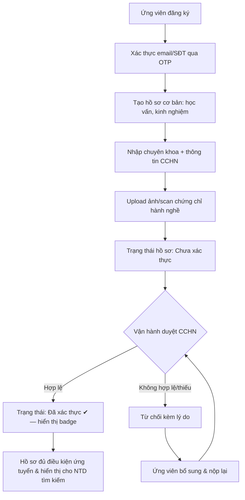
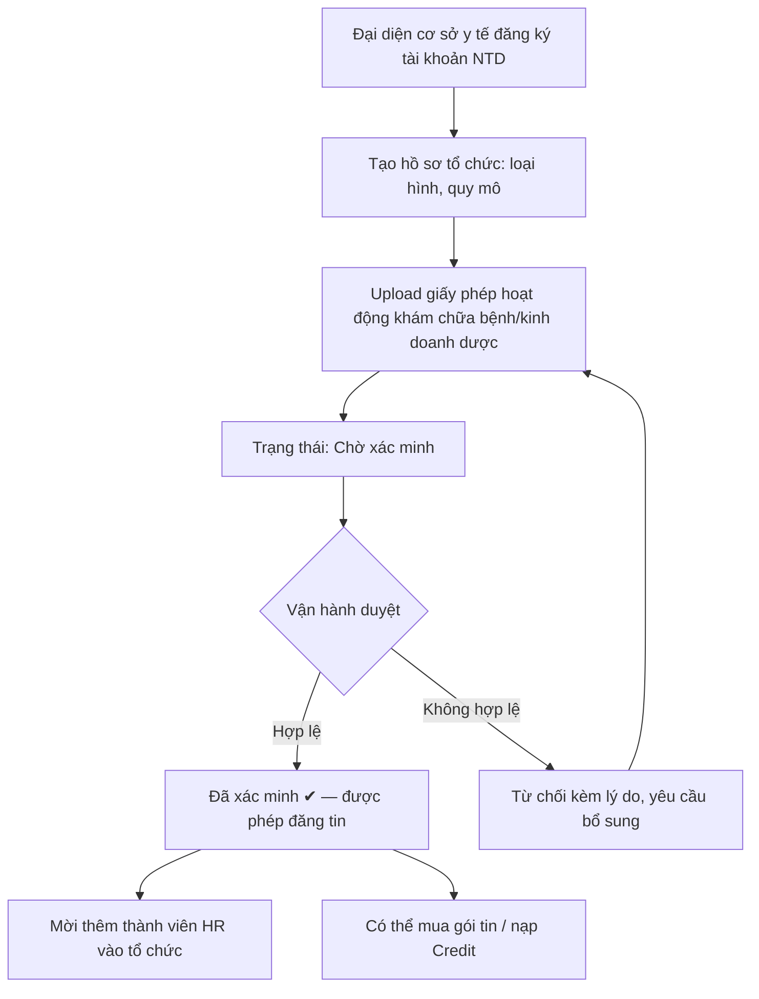
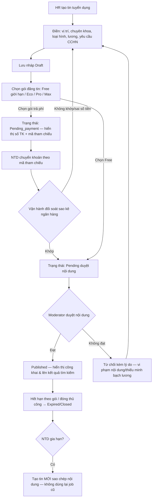
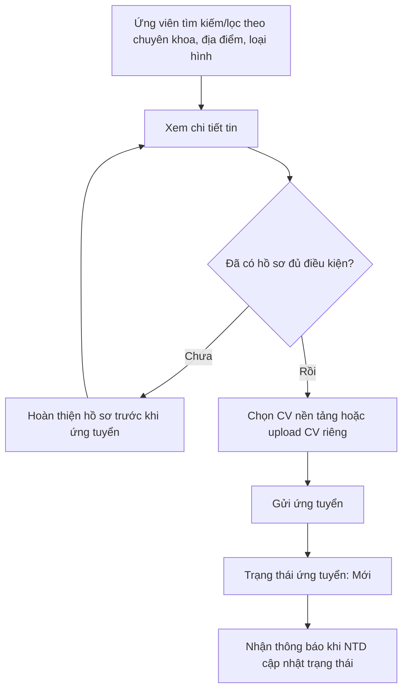
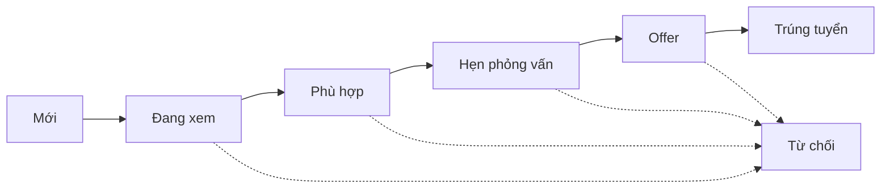
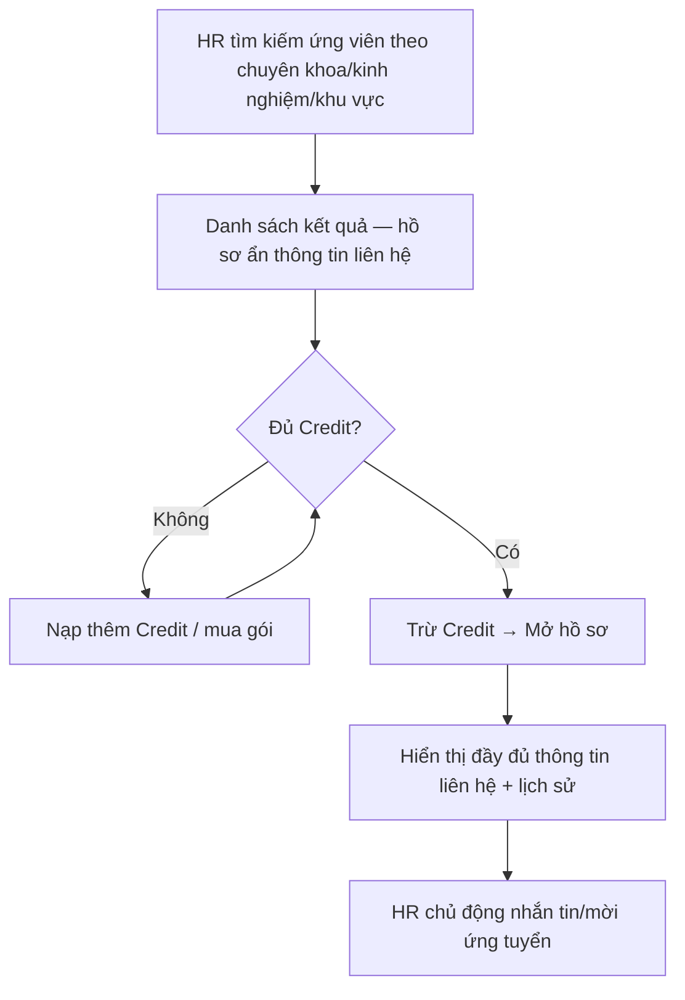
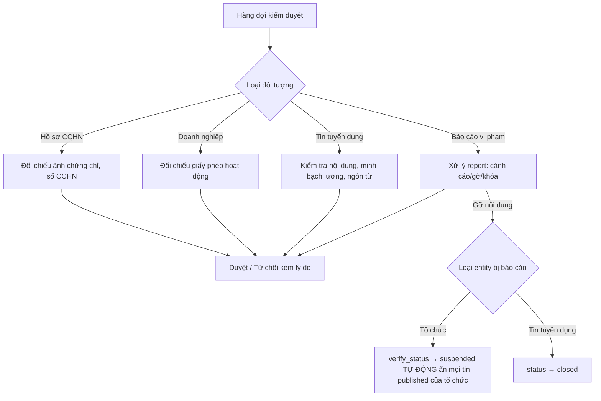

# GiapTech.BlouseHiding — Luồng nghiệp vụ & Danh sách màn hình

> Cụ thể hóa từ [`PHAN-TICH-NGHIEP-VU.md`](./PHAN-TICH-NGHIEP-VU.md) (mục 3 — Phạm vi nghiệp vụ).
> Tài liệu này mô tả **luồng nghiệp vụ chi tiết** (theo actor) và **danh sách màn hình** ở mức đủ để
> lên wireframe. Sơ đồ dùng cú pháp Mermaid — GitHub render trực tiếp.
>
> **Quy ước tên site**: **Client** (Ứng viên/Khách) · **Admin** (Nhà tuyển dụng) · **Vận hành** (đội
> nội bộ nền tảng) — xem [`PHAN-TICH-NGHIEP-VU.md`](./PHAN-TICH-NGHIEP-VU.md) mục 2. Trong các sơ đồ
> dưới đây, node ghi "Vận hành" là đội nội bộ nền tảng, **không phải** trang Admin của NTD.

---

## 1. Luồng nghiệp vụ chính

### 1.1 Đăng ký & xác thực hồ sơ ứng viên (kèm CCHN)

**Điểm cần lưu ý:**
- Hồ sơ **chưa xác thực CCHN vẫn được tạo & dùng để ứng tuyển**, nhưng gắn nhãn "chưa xác thực" —
  không chặn cứng, tránh mất người dùng mới (giống chiến lược "đăng ký nhanh" của TopCV), nhưng NTD
  luôn thấy rõ trạng thái.
- CCHN có **ngày hết hạn** → hệ thống tự động cảnh báo/hết hiệu lực badge khi quá hạn, nhắc ứng viên gia hạn.

### 1.2 Đăng ký & xác minh cơ sở y tế (Employer)

### 1.3 Đăng tin tuyển dụng + mua gói (monetization)

**Điểm cần lưu ý:**
- `Pending_payment` là trạng thái **chờ đối soát chuyển khoản thủ công** (xem
  [ADR-0003](../kien-truc/adr/0003-hoan-cong-thanh-toan-tu-dong.md)) — khác với `Pending` (chờ duyệt
  nội dung). Không gộp 2 ý nghĩa vào 1 trạng thái để tránh Vận hành nhầm lẫn hàng đợi.
- **"Gia hạn" luôn tạo tin mới**, không dùng lại tin cũ — nhờ vậy ứng viên từng bị từ chối ở đợt tuyển
  trước vẫn ứng tuyển được ở đợt mới (tin mới = `job_id` khác).

### 1.4 Tìm việc & ứng tuyển (Candidate)

### 1.5 Quản lý ứng viên — ATS pipeline (Employer)

- Mỗi chuyển trạng thái ghi log + gửi thông báo ứng viên (trừ khi HR chọn "âm thầm").
- HR có thể gắn nhãn, ghi chú nội bộ, chấm điểm hồ sơ (CV Scoring) ở bất kỳ bước nào.
- **CV Scoring tính 1 lần lúc ứng tuyển** (dựa trên bản chụp hồ sơ tại thời điểm đó), không tự tính lại
  khi ứng viên sửa hồ sơ sau này — tránh thứ hạng trong bảng Kanban nhảy loạn không báo trước cho HR.
- Bảng ATS **vẫn thao tác được bình thường** dù tin đã Hết hạn/Đóng/bị Vận hành ẩn (`suspended`) — chỉ
  phần hiển thị công khai của tin bị ảnh hưởng, không khóa việc xử lý ứng viên đang dở dang.

### 1.6 Tìm & mở hồ sơ ứng viên chủ động (Credit — tham khảo TopCV)

### 1.7 Kiểm duyệt & vận hành (trang Vận hành — Admin/Moderator)

**Điểm cần lưu ý:**
- Rút xác thực tổ chức (`verified → suspended/rejected`, dù từ hàng đợi báo cáo hay do Vận hành tự phát
  hiện) **luôn kéo theo** tự động ẩn (`suspended`) mọi tin đang `published` của tổ chức đó trong cùng
  thao tác — không phải bước thủ công riêng dễ quên. Muốn tin hiện lại: tổ chức phải được `verified`
  lại **và** từng tin phải được duyệt lại thủ công (không tự động published lại).

---

## 2. Danh sách màn hình (Screen Inventory)

### 2.1 Public / Khách (chưa đăng nhập)

| Màn hình | Mô tả |
|---|---|
| Trang chủ | Giới thiệu nền tảng, tìm kiếm nhanh, tin nổi bật, cơ sở y tế nổi bật |
| Tìm việc (danh sách) | Bộ lọc: chuyên khoa, địa điểm, loại hình, mức lương, tuyến |
| Chi tiết tin tuyển dụng | Mô tả công việc, yêu cầu CCHN, phúc lợi, nút "Ứng tuyển ngay" (yêu cầu đăng nhập) |
| Trang cơ sở y tế | Giới thiệu tổ chức, danh sách tin đang tuyển, đánh giá (Giai đoạn 2) |
| Đăng ký / Đăng nhập | Chọn vai trò Ứng viên hay NTD, OAuth Google/Zalo, OTP |
| Góc nghề y (Giai đoạn 3) | Bài viết, sự kiện/CME, học bổng |

### 2.2 Ứng viên (Candidate)

| Màn hình | Mô tả |
|---|---|
| Dashboard ứng viên | Tổng quan: độ hoàn thiện hồ sơ, việc đã ứng tuyển, gợi ý việc làm |
| Hồ sơ cá nhân | Thông tin chung, học vấn, kinh nghiệm, kỹ năng |
| Hồ sơ CCHN & chuyên khoa | Nhập/sửa số CCHN, upload chứng chỉ, chọn chuyên khoa, xem trạng thái xác thực |
| CV Builder | Chọn mẫu, chỉnh sửa, xuất PDF |
| Danh sách việc đã lưu | Việc đã bookmark |
| Việc đã ứng tuyển | Theo dõi trạng thái từng đơn ứng tuyển (pipeline view rút gọn) |
| Tin nhắn | Chat với NTD |
| Thông báo | Danh sách thông báo |
| Cài đặt tài khoản | Đổi mật khẩu, quyền riêng tư, xóa tài khoản (tuân thủ NĐ 13/2023) |
| Công cụ tiện ích (GĐ2) | Tính phụ cấp trực/độc hại, thuế TNCN, test năng lực |

### 2.3 Trang Admin — Nhà tuyển dụng (Employer / HR)

| Màn hình | Mô tả |
|---|---|
| Dashboard NTD | Số liệu: tin đang chạy, số ứng tuyển mới, số dư Credit |
| Hồ sơ tổ chức | Thông tin cơ sở y tế, trạng thái xác minh, upload giấy phép |
| Quản lý thành viên HR | Mời/xóa thành viên, phân quyền trong tổ chức |
| Danh sách tin tuyển dụng | Draft / Chờ thanh toán / Pending / Published / Expired / Suspended — thao tác sửa, gia hạn (tạo tin mới), đóng tin |
| Tạo/sửa tin tuyển dụng | Form đầy đủ trường + chọn gói đăng tin |
| Mua gói tin | Bảng so sánh Eco/Pro/Max — hiển thị số TK chuyển khoản + mã tham chiếu (thủ công ở MVP) |
| Ví Credit | Số dư, nạp thêm (chuyển khoản + mã tham chiếu), lịch sử giao dịch |
| Tìm kiếm ứng viên chủ động | Bộ lọc theo chuyên khoa/kinh nghiệm/khu vực, mở hồ sơ bằng Credit |
| ATS — Bảng ứng viên (Kanban) | Theo từng tin: cột trạng thái Mới → Trúng tuyển, kéo-thả, ghi chú, chấm điểm |
| Chi tiết ứng viên | Hồ sơ đầy đủ (sau khi mở), CV, ghi chú nội bộ, lịch sử tương tác |
| Tin nhắn | Chat với ứng viên |
| Thông báo | Danh sách thông báo |

### 2.4 Trang Vận hành — Quản trị nền tảng (Admin / Moderator)

| Màn hình | Mô tả |
|---|---|
| Dashboard tổng quan | Số liệu toàn hệ thống: người dùng, tin, doanh thu |
| Hàng đợi duyệt CCHN | Danh sách hồ sơ chờ duyệt, xem ảnh chứng chỉ, duyệt/từ chối kèm lý do |
| Hàng đợi duyệt doanh nghiệp | Duyệt giấy phép hoạt động |
| Hàng đợi duyệt tin tuyển dụng | Duyệt nội dung tin trước khi publish (riêng biệt với hàng đợi chờ thanh toán) |
| Đối soát thanh toán thủ công | Danh sách giao dịch `pending` kèm mã tham chiếu, xác nhận/từ chối theo sao kê ngân hàng |
| Quản lý danh mục | Chuyên khoa, tuyến, địa điểm, loại hình làm việc |
| Quản lý gói dịch vụ | Cấu hình tier Eco/Pro/Max, giá Credit |
| Quản lý người dùng | Tìm kiếm, khóa/mở khóa tài khoản |
| Xử lý báo cáo/spam | Danh sách report, hành động xử lý (gỡ nội dung tự động kéo theo ẩn tin/rút xác thực tổ chức) |
| Nhật ký kiểm toán (Audit log) | Tra cứu lịch sử thao tác nhạy cảm (NĐ 13/2023) |

---

## 3. Ma trận Actor × Module (tham chiếu nhanh)

| Module | Guest (Client) | Candidate (Client) | Employer (trang Admin) | Vận hành |
|---|:---:|:---:|:---:|:---:|
| Tìm & xem tin | ✔ | ✔ | ✔ | ✔ |
| Hồ sơ & CCHN | – | ✔ (sở hữu) | xem (sau unlock) | duyệt |
| Đăng tin | – | – | ✔ | duyệt |
| Ứng tuyển / ATS | – | ✔ (nộp đơn) | ✔ (quản lý) | – |
| Credit / mua gói | – | – | ✔ | cấu hình |
| Chat | – | ✔ | ✔ | – |
| Sự kiện/CME (GĐ3) | xem | đăng ký | tổ chức (nếu có) | duyệt |
| Quản trị hệ thống | – | – | – | ✔ |

---

## 4. Xem thêm

- Schema đầy đủ: [`../database/ERD-CHI-TIET.md`](../database/ERD-CHI-TIET.md)
- Endpoint theo từng module ở mục 2.1–2.4 trên: [`../backend/API-DESIGN.md`](../backend/API-DESIGN.md)
- Wireframe trực quan: [`../frontend/wireframes/`](../frontend/wireframes/)
